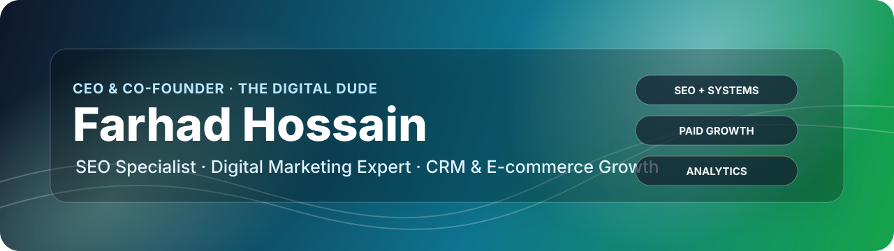

<div align="center">

  

  <br />

  <a href="https://farhad-portfolio-two.vercel.app/"></a>
  <a href="https://digitaldude.co.uk/"></a>
  <a href="https://www.linkedin.com/in/neiloy-farhad/"></a>
  <a href="mailto:info@digitaldude.co.uk"></a>

</div>

## I build growth systems where marketing, websites, CRM, and analytics work together.

I am **Farhad Hossain**, CEO & Co-Founder of [The Digital Dude](https://digitaldude.co.uk/). My work sits at the intersection of SEO, paid acquisition, CRM workflows, e-commerce growth, analytics, and conversion-focused web systems.

The goal is simple: help businesses turn visibility into better leads, better customer journeys, and cleaner marketing operations.

<table>
  <tr>
    <td align="center" width="20%">
      <strong>30%</strong><br />
      <sub>organic traffic growth</sub>
    </td>
    <td align="center" width="20%">
      <strong>200+</strong><br />
      <sub>bookings generated</sub>
    </td>
    <td align="center" width="20%">
      <strong>40+</strong><br />
      <sub>instructor registrations</sub>
    </td>
    <td align="center" width="20%">
      <strong>20%</strong><br />
      <sub>sales increase</sub>
    </td>
    <td align="center" width="20%">
      <strong>30+</strong><br />
      <sub>public GitHub repos</sub>
    </td>
  </tr>
</table>

## What I Do

<table>
  <tr>
    <td width="33%">
      <h3>Search Growth</h3>
      <p>SEO strategy, keyword mapping, on-page structure, technical checks, Search Console review, and content direction built around buyer intent.</p>
    </td>
    <td width="33%">
      <h3>Paid Acquisition</h3>
      <p>Google Ads, Meta Ads, retargeting, campaign planning, landing page alignment, and conversion tracking for clearer performance decisions.</p>
    </td>
    <td width="33%">
      <h3>CRM & Conversion</h3>
      <p>Lead workflows, customer follow-up, WooCommerce growth, reporting systems, and website improvements that reduce friction.</p>
    </td>
  </tr>
</table>

## Featured Work

<table>
  <tr>
    <td width="50%">
      <h3><a href="https://farhad-portfolio-two.vercel.app/">Farhad Portfolio</a></h3>
      <p>Personal brand site with SEO positioning, service pages, case studies, experience timeline, and conversion-focused contact flow.</p>
      <p><strong>Focus:</strong> personal brand, SEO, case studies, marketing authority</p>
    </td>
    <td width="50%">
      <h3><a href="https://the-digital-dude.vercel.app">The Digital Dude</a></h3>
      <p>Digital solutions agency presence for web apps, SaaS, ERP, CRM, HRM, and business automation systems.</p>
      <p><strong>Focus:</strong> agency positioning, productized services, trust building</p>
    </td>
  </tr>
  <tr>
    <td width="50%">
      <h3><a href="https://ai-learning-platform-xi-sand.vercel.app">AI Learning Platform</a></h3>
      <p>Modern learning platform concept built around structured courses, product UI, and scalable education workflows.</p>
      <p><strong>Repo:</strong> <a href="https://github.com/neiloy-neil/ai-learning-platform">ai-learning-platform</a></p>
    </td>
    <td width="50%">
      <h3><a href="https://trucker-link.vercel.app">TruckerLink</a></h3>
      <p>Truck breakdown and logistics workflow platform designed for faster coordination between drivers, mechanics, and admins.</p>
      <p><strong>Repo:</strong> <a href="https://github.com/neiloy-neil/TruckerLink">TruckerLink</a></p>
    </td>
  </tr>
</table>

## Case Study Results

| Client / Project | Role | Outcome |
| --- | --- | --- |
| The Sunnah Store | CRM and SEO Specialist | 30% organic traffic growth through SEO and customer workflow support |
| My Instructor PTY Ltd | Marketing Executive | 200+ bookings and 40+ instructor registrations |
| E-commerce Growth Campaign | Growth and campaign support | 20% sales increase through acquisition and promotional planning |
| TruckerLink | Workflow and platform support | 40% response time improvement through better coordination flow |

## Skills Stack

<table>
  <tr>
    <td width="25%">
      <strong>SEO</strong><br />
      <sub>Keyword Research · On-page SEO · Technical SEO · Search Console</sub>
    </td>
    <td width="25%">
      <strong>Paid Media</strong><br />
      <sub>Google Ads · Meta Ads · Retargeting · Conversion Tracking</sub>
    </td>
    <td width="25%">
      <strong>Analytics</strong><br />
      <sub>GA4 · Looker Studio · Campaign Reports · Performance Review</sub>
    </td>
    <td width="25%">
      <strong>Web Growth</strong><br />
      <sub>WordPress · WooCommerce · Elementor · Landing Pages</sub>
    </td>
  </tr>
</table>

<p>
  
  
  
  
  
  
  
  
  
</p>

## GitHub Portfolio Map

| Category | Repositories |
| --- | --- |
| AI and SaaS | [AI Learning Platform](https://github.com/neiloy-neil/ai-learning-platform), [AI Writing Tool](https://github.com/neiloy-neil/ai-writing-tool), [AI Outreach Architect](https://github.com/neiloy-neil/AI-Outreach-Architect) |
| Business systems | [TruckerLink](https://github.com/neiloy-neil/TruckerLink), [Inventory Management System](https://github.com/neiloy-neil/Inventory-Management-System), [RMS Platform](https://github.com/neiloy-neil/RMS-platform) |
| Marketing pages | [Digital Marketing Agency](https://github.com/neiloy-neil/digital-marketing-agency), [Conversion Catalyst](https://github.com/neiloy-neil/conversion-catalyst), [Startup MVP Launch Page](https://github.com/neiloy-neil/startup-mvp-launch-page) |
| Brand and agency | [Farhad Portfolio](https://github.com/neiloy-neil/farhad-portfolio), [The Digital Dude](https://github.com/neiloy-neil/The-Digital-Dude), [Elite Portfolio](https://github.com/neiloy-neil/elite-portfolio) |

## Experience

```txt
The Digital Dude              CEO & Co-Founder                         Jul 2020 - Present
Bindu                         Social Media & Website Manager           Feb 2025 - Present
STYLETECK INNOVATIONS LTD     Web & Digital Marketing Executive         Aug 2024 - Sep 2024
The Sunnah Store              Customer Relationship Executive           Dec 2023 - Jul 2024
Innovate Wave                 Marketing Lead                            May 2023 - Dec 2023
```

## Current Direction

<table>
  <tr>
    <td width="50%">
      <strong>Building</strong>
      <p>Growth-focused websites, campaign funnels, CRM-backed lead flows, and polished digital product demos.</p>
    </td>
    <td width="50%">
      <strong>Improving</strong>
      <p>Search visibility, conversion tracking, reporting clarity, customer follow-up, and business automation systems.</p>
    </td>
  </tr>
</table>

## Let's Connect

Open to conversations around SEO strategy, e-commerce growth, CRM systems, paid campaign planning, digital product delivery, and founder-led web execution.

<p>
  <a href="https://farhad-portfolio-two.vercel.app/"></a>
  <a href="https://www.linkedin.com/in/neiloy-farhad/"></a>
  <a href="mailto:info@digitaldude.co.uk"></a>
</p>

<div align="center">

  <sub>SEO, digital strategy, CRM systems, and conversion-focused execution from Bangladesh to global clients.</sub>

</div>
